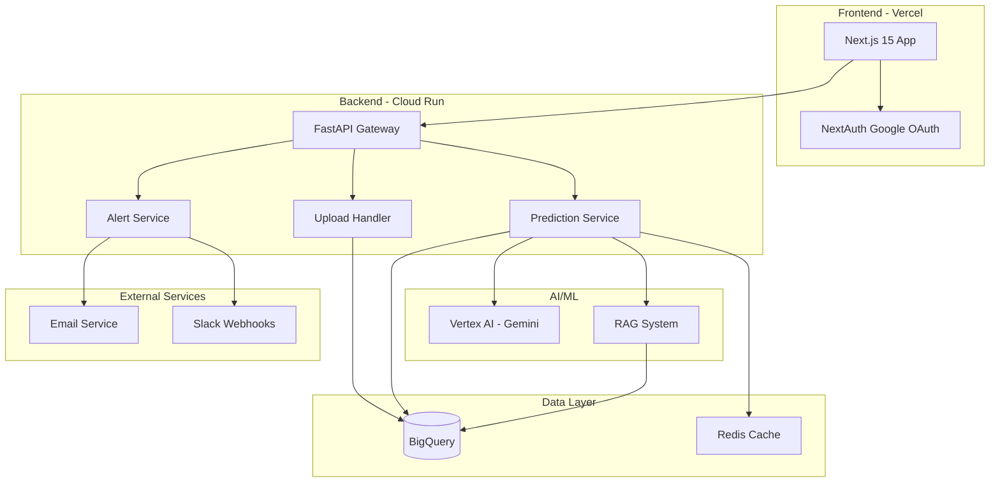

# Design Document: Hospital Stress Early Warning System

## Overview

The Hospital Stress Early Warning System is a full-stack web application that leverages AI/ML to predict hospital capacity crises before they occur. The system consists of a Next.js frontend, FastAPI backend, BigQuery data warehouse, and Google Vertex AI for predictions. The architecture follows a microservices pattern with clear separation between data ingestion, prediction generation, and user interface layers.

The system processes historical hospital logs (admissions, bed occupancy, staffing levels) to generate 7-day forecasts of bed demand and staff overload risk. It provides actionable recommendations, automated alerts, and interactive what-if scenario simulations to help hospital administrators make proactive decisions.

## Architecture

### High-Level Architecture



### Component Responsibilities

**Frontend (Next.js 15)**
- Server-side rendering for landing page
- Client-side dashboard with real-time updates
- Google OAuth integration via NextAuth
- Shadcn/UI components with Tailwind styling
- Dark mode support
- Drag-drop CSV upload interface
- Interactive what-if simulator with sliders
- Natural language chat interface

**Backend (FastAPI)**
- RESTful API endpoints
- Request validation and error handling
- CSV parsing and data validation
- Orchestration of prediction requests
- Alert threshold monitoring
- Session management

**Prediction Engine (Python + Vertex AI)**
- Time-series forecasting using Gemini
- Pattern extraction from historical data
- Confidence score calculation
- Chain-of-thought reasoning for recommendations
- Few-shot prompt engineering
- Multi-scenario what-if analysis

**Data Store (BigQuery)**
- Historical hospital logs storage
- Efficient time-series queries
- Synthetic data generation
- Data quality validation

**Alert Service**
- Threshold monitoring
- Email template rendering
- Slack webhook integration
- Alert history tracking

**RAG System**
- Historical crisis lesson retrieval
- Context-aware recommendation enhancement
- Vector embeddings for similarity search

## Components and Interfaces

### 1. Upload Handler

**Purpose:** Process CSV uploads and store data in BigQuery

**Interface:**
```python
class UploadHandler:
    def validate_csv(self, file: UploadFile) -> ValidationResult:
        """
        Validates CSV schema and data types
        Returns: ValidationResult with errors or success
        """
        pass
    
    def parse_csv(self, file: UploadFile) -> List[HospitalRecord]:
        """
        Parses CSV into structured records
        Returns: List of HospitalRecord objects
        """
        pass
    
    def store_records(self, records: List[HospitalRecord]) -> StorageResult:
        """
        Stores records in BigQuery, handling duplicates
        Returns: StorageResult with count and warnings
        """
        pass
    
    def check_file_size(self, file: UploadFile) -> bool:
        """
        Validates file size is under 50MB
        Returns: True if valid, False otherwise
        """
        pass
```

**Dependencies:**
- BigQuery client for data storage
- CSV parsing library (pandas)
- File validation utilities

### 2. Prediction Engine

**Purpose:** Generate bed demand forecasts and staff risk scores using AI/ML

**Interface:**
```python
class PredictionEngine:
    def forecast_bed_demand(
        self, 
        days_ahead: int = 7,
        historical_data: Optional[List[HospitalRecord]] = None
    ) -> BedForecast:
        """
        Generates 7-day bed demand forecast
        Returns: BedForecast with daily predictions and confidence scores
        """
        pass
    
    def calculate_staff_risk(
        self,
        predicted_admissions: int,
        current_staff: int,
        historical_overloads: List[OverloadEvent]
    ) -> StaffRiskScore:
        """
        Calculates staff overload risk (0-100)
        Returns: StaffRiskScore with score and confidence
        """
        pass
    
    def generate_recommendations(
        self,
        bed_stress: float,
        staff_risk: float,
        historical_context: List[HospitalRecord]
    ) -> List[Recommendation]:
        """
        Generates 3 prioritized recommendations with cost estimates
        Returns: List of Recommendation objects ranked by impact
        """
        pass
    
    def simulate_scenario(
        self,
        baseline_forecast: BedForecast,
        sick_rate: float,
        admission_surge: float
    ) -> ScenarioResult:
        """
        Simulates what-if scenario with adjusted parameters
        Returns: ScenarioResult with modified predictions
        """
        pass
    
    def calculate_confidence(
        self,
        data_quality: float,
        data_completeness: float,
        historical_accuracy: float
    ) -> float:
        """
        Calculates confidence score for predictions
        Returns: Confidence score (0-100)
        """
        pass
```

**Dependencies:**
- Vertex AI client (Gemini model)
- BigQuery client for historical data
- Redis cache for prediction caching
- RAG system for recommendation enhancement

### 3. Alert Service

**Purpose:** Monitor thresholds and send notifications

**Interface:**
```python
class AlertService:
    def check_thresholds(
        self,
        bed_stress: float,
        staff_risk: float,
        thresholds: AlertThresholds
    ) -> List[AlertTrigger]:
        """
        Checks if any thresholds are exceeded
        Returns: List of triggered alerts
        """
        pass
    
    def send_email_alert(
        self,
        recipients: List[str],
        alert_data: AlertData,
        template: str = "hospital_letterhead"
    ) -> EmailResult:
        """
        Sends formatted email notification
        Returns: EmailResult with delivery status
        """
        pass
    
    def send_slack_alert(
        self,
        webhook_url: str,
        alert_data: AlertData
    ) -> SlackResult:
        """
        Sends Slack notification via webhook
        Returns: SlackResult with delivery status
        """
        pass
    
    def format_alert_message(
        self,
        alert_type: str,
        risk_score: float,
        recommendations: List[Recommendation]
    ) -> str:
        """
        Formats alert message with recommendations
        Returns: Formatted message string
        """
        pass
```

**Dependencies:**
- Email service (SendGrid or similar)
- Slack webhook client
- Template rendering engine

### 4. RAG System

**Purpose:** Retrieve historical crisis lessons to enhance recommendations

**Interface:**
```python
class RAGSystem:
    def retrieve_similar_crises(
        self,
        current_context: HospitalContext,
        top_k: int = 5
    ) -> List[CrisisLesson]:
        """
        Retrieves similar historical crisis events
        Returns: List of relevant CrisisLesson objects
        """
        pass
    
    def generate_embeddings(
        self,
        crisis_description: str
    ) -> np.ndarray:
        """
        Generates vector embeddings for crisis descriptions
        Returns: Embedding vector
        """
        pass
    
    def enhance_recommendations(
        self,
        base_recommendations: List[Recommendation],
        historical_lessons: List[CrisisLesson]
    ) -> List[Recommendation]:
        """
        Enhances recommendations with historical insights
        Returns: Enhanced recommendation list
        """
        pass
```

**Dependencies:**
- Vertex AI embeddings API
- BigQuery for crisis history storage
- Vector similarity search library

### 5. API Gateway (FastAPI)

**Purpose:** Expose REST endpoints for frontend integration

**Endpoints:**

```python
# POST /upload-logs
@app.post("/upload-logs")
async def upload_logs(file: UploadFile) -> UploadResponse:
    """
    Accepts CSV file and stores in BigQuery
    Returns: UploadResponse with status and record count
    """
    pass

# POST /predict-beds
@app.post("/predict-beds")
async def predict_beds(request: PredictRequest) -> BedForecast:
    """
    Generates 7-day bed demand forecast
    Returns: BedForecast with daily predictions
    """
    pass

# POST /staff-risk
@app.post("/staff-risk")
async def staff_risk(request: StaffRiskRequest) -> StaffRiskScore:
    """
    Calculates staff overload risk
    Returns: StaffRiskScore with score and confidence
    """
    pass

# GET /dashboard-data
@app.get("/dashboard-data")
async def dashboard_data() -> DashboardData:
    """
    Returns 7-day stress summary for dashboard
    Returns: DashboardData with all metrics
    """
    pass

# POST /recommendations
@app.post("/recommendations")
async def recommendations(request: RecommendationRequest) -> List[Recommendation]:
    """
    Generates prioritized recommendations
    Returns: List of 3 Recommendation objects
    """
    pass

# POST /send-alert
@app.post("/send-alert")
async def send_alert(request: AlertRequest) -> AlertResponse:
    """
    Triggers email or Slack notification
    Returns: AlertResponse with delivery status
    """
    pass

# POST /simulate-scenario
@app.post("/simulate-scenario")
async def simulate_scenario(request: ScenarioRequest) -> ScenarioResult:
    """
    Runs what-if scenario simulation
    Returns: ScenarioResult with modified predictions
    """
    pass
```

## Data Models

### HospitalRecord
```python
@dataclass
class HospitalRecord:
    date: datetime
    admissions: int
    beds_occupied: int
    staff_on_duty: int
    overload_flag: bool
    
    def validate(self) -> bool:
        """Validates data types and ranges"""
        return (
            self.admissions >= 0 and
            self.beds_occupied >= 0 and
            self.staff_on_duty >= 0
        )
```

### BedForecast
```python
@dataclass
class BedForecast:
    predictions: List[DailyPrediction]
    overall_confidence: float
    generated_at: datetime
    
@dataclass
class DailyPrediction:
    date: datetime
    predicted_beds: int
    bed_stress: float  # 0-100
    confidence: float  # 0-100
    is_high_risk: bool  # True if bed_stress > 85
```

### StaffRiskScore
```python
@dataclass
class StaffRiskScore:
    risk_score: float  # 0-100
    confidence: float  # 0-100
    is_critical: bool  # True if risk_score > 75
    contributing_factors: List[str]
    generated_at: datetime
```

### Recommendation
```python
@dataclass
class Recommendation:
    title: str
    description: str
    rationale: str  # Chain-of-thought explanation
    cost_estimate: float
    impact_score: float  # 0-100
    priority: int  # 1, 2, or 3
    implementation_time: str  # e.g., "24 hours", "3 days"
```

### AlertData
```python
@dataclass
class AlertData:
    alert_type: str  # "bed_stress" or "staff_risk"
    risk_score: float
    threshold: float
    predictions: List[DailyPrediction]
    recommendations: List[Recommendation]
    generated_at: datetime
```

### ScenarioRequest
```python
@dataclass
class ScenarioRequest:
    sick_rate: float  # 0.0 to 0.5
    admission_surge: float  # -0.3 to 1.0
    baseline_date: datetime
```

### ScenarioResult
```python
@dataclass
class ScenarioResult:
    baseline_forecast: BedForecast
    scenario_forecast: BedForecast
    baseline_staff_risk: StaffRiskScore
    scenario_staff_risk: StaffRiskScore
    impact_summary: str
```

### ValidationResult
```python
@dataclass
class ValidationResult:
    is_valid: bool
    errors: List[str]
    warnings: List[str]
```

### DashboardData
```python
@dataclass
class DashboardData:
    bed_stress_current: float
    staff_risk_current: float
    active_alerts_count: int
    recommendations_count: int
    seven_day_forecast: BedForecast
    seven_day_staff_risk: List[StaffRiskScore]
    trend_indicators: Dict[str, str]  # "up", "down", "stable"
```

## Correctness Properties

*A property is a characteristic or behavior that should hold true across all valid executions of a system—essentially, a formal statement about what the system should do. Properties serve as the bridge between human-readable specifications and machine-verifiable correctness guarantees.*


### Property 1: CSV Upload Round Trip

*For any* valid HospitalRecord list, uploading the records as CSV then querying the Data_Store should return equivalent records with the same data values.

**Validates: Requirements 1.1**

### Property 2: Invalid CSV Rejection

*For any* CSV file with invalid data types or missing required columns, the Upload_Handler should reject the upload and return a descriptive error message.

**Validates: Requirements 1.2**

### Property 3: Duplicate Date Deduplication

*For any* CSV file containing duplicate date entries, the Upload_Handler should store only the most recent entry for each date and log a warning.

**Validates: Requirements 1.4**

### Property 4: Forecast Length Consistency

*For any* forecast request, the Prediction_Engine should return exactly 7 daily predictions regardless of the amount of historical data available.

**Validates: Requirements 2.1**

### Property 5: Graceful Handling of Missing Data

*For any* historical dataset with gaps or missing values, the Prediction_Engine should still generate predictions without throwing errors.

**Validates: Requirements 2.2**

### Property 6: Prediction Structure Completeness

*For any* bed forecast, each daily prediction should include all required fields: date, predicted_beds, bed_stress, confidence, and is_high_risk flag.

**Validates: Requirements 2.3**

### Property 7: Bed Stress Calculation Accuracy

*For any* prediction with predicted_beds and total_capacity values, the bed_stress should equal (predicted_beds / total_capacity) * 100.

**Validates: Requirements 2.4**

### Property 8: High Risk Flagging Threshold

*For any* daily prediction, the is_high_risk flag should be True if and only if bed_stress exceeds 85%.

**Validates: Requirements 2.5**

### Property 9: Staff Risk Score Range

*For any* staff risk calculation, the risk_score should be within the range [0, 100] inclusive.

**Validates: Requirements 3.1**

### Property 10: Critical Risk Classification

*For any* staff risk score, the is_critical flag should be True if and only if risk_score exceeds 75.

**Validates: Requirements 3.3**

### Property 11: Risk Score Structure Completeness

*For any* staff risk score, it should include all required fields: risk_score, confidence, is_critical, contributing_factors, and generated_at timestamp.

**Validates: Requirements 3.5**

### Property 12: Scenario Recalculation Responsiveness

*For any* scenario parameter adjustment (sick_rate or admission_surge), the What_If_Simulator should produce a new forecast that differs from the baseline forecast.

**Validates: Requirements 4.1**

### Property 13: Recommendation Count Consistency

*For any* high-risk scenario (Bed_Stress > 85 or Staff_Risk > 75), the Prediction_Engine should generate exactly 3 recommendations.

**Validates: Requirements 5.1**

### Property 14: Recommendation Structure Completeness

*For any* recommendation, it should include all required fields: title, description, rationale, cost_estimate, impact_score, priority, and implementation_time.

**Validates: Requirements 5.2, 5.3**

### Property 15: Recommendation Priority Ordering

*For any* list of recommendations, they should be ordered by priority (1, 2, 3) and the impact-to-cost ratio should be non-increasing.

**Validates: Requirements 5.4**

### Property 16: Threshold-Based Alert Triggering

*For any* risk score (Staff_Risk or Bed_Stress) and configured threshold, the Alert_Service should trigger an alert if and only if the risk score exceeds the threshold.

**Validates: Requirements 6.1, 6.2**

### Property 17: Conditional Slack Notification

*For any* alert trigger, if a Slack webhook URL is configured, the Alert_Service should send a Slack notification in addition to email.

**Validates: Requirements 6.3**

### Property 18: Alert Template Application

*For any* email alert, the message should be formatted using the hospital letterhead template.

**Validates: Requirements 6.4**

### Property 19: Alert Content Completeness

*For any* alert notification, it should include the current risk score, predicted timeline, and exactly 3 recommendations.

**Validates: Requirements 6.5**

### Property 20: Dashboard Data Structure

*For any* dashboard data response, it should include exactly 7 days of forecasts and all 4 status metrics: bed_stress_current, staff_risk_current, active_alerts_count, and recommendations_count.

**Validates: Requirements 8.2**

### Property 21: Trend Indicator Calculation

*For any* time-series of stress values, the trend indicator should be "up" if the most recent value exceeds the previous value, "down" if it's less, and "stable" if equal.

**Validates: Requirements 8.5**

### Property 22: Conversation Context Preservation

*For any* sequence of natural language queries in the same session, the System should maintain context such that follow-up questions can reference previous queries.

**Validates: Requirements 9.5**

### Property 23: Onboarding Progress Persistence

*For any* partially completed onboarding wizard, if the user exits and returns, the System should restore progress to the last completed step.

**Validates: Requirements 10.5**

### Property 24: API Error Response Format

*For any* invalid API request (missing parameters, wrong types, etc.), the API_Gateway should return a 400 status code with a descriptive error message in the response body.

**Validates: Requirements 11.7**

### Property 25: API Success Response Format

*For any* valid API request, the API_Gateway should return a 200 status code with the requested data in the response body.

**Validates: Requirements 11.8**

### Property 26: Forward-Fill Interpolation

*For any* historical dataset with missing values in beds_occupied or staff_on_duty columns, the Prediction_Engine should apply forward-fill interpolation before generating predictions.

**Validates: Requirements 12.1**

### Property 27: Confidence Score Degradation

*For any* two datasets where one is sparser or more incomplete than the other, predictions based on the sparser dataset should have lower confidence scores.

**Validates: Requirements 12.4**

### Property 28: Prediction Caching

*For any* prediction request, if an identical request was made within the last 15 minutes, the System should return the cached result without calling Vertex AI.

**Validates: Requirements 13.5**

## Error Handling

### Upload Errors

**File Size Validation:**
- Check file size before parsing
- Return 413 Payload Too Large for files > 50MB
- Include size limit in error message

**Schema Validation:**
- Validate required columns: date, admissions, beds_occupied, staff_on_duty, overload_flag
- Validate data types for each column
- Return 400 Bad Request with specific column errors
- Example error: "Column 'admissions' contains non-integer values at rows [5, 12, 23]"

**Data Quality Warnings:**
- Log warnings for duplicate dates (non-fatal)
- Log warnings for suspicious values (e.g., negative numbers)
- Continue processing with warnings

### Prediction Errors

**Insufficient Data:**
- If < 7 days of data: Return warning but attempt prediction with synthetic data
- If < 30 days of data: Include low confidence warning in response
- If no data: Generate 6 months of synthetic data automatically

**AI/ML Service Failures:**
- Implement retry logic with exponential backoff (3 attempts)
- If Vertex AI unavailable: Return 503 Service Unavailable
- Cache last successful prediction as fallback
- Include error context in response

**Invalid Scenario Parameters:**
- Validate sick_rate in range [0.0, 0.5]
- Validate admission_surge in range [-0.3, 1.0]
- Return 400 Bad Request with parameter constraints

### Alert Errors

**Email Delivery Failures:**
- Log failed email attempts
- Retry up to 3 times with 1-minute delays
- Store failed alerts in database for manual review
- Return 500 Internal Server Error if all retries fail

**Slack Webhook Failures:**
- Validate webhook URL format before sending
- Handle 404 (invalid webhook) and 500 (Slack service error)
- Log failures but don't block email alerts
- Return partial success if email succeeds but Slack fails

### Authentication Errors

**OAuth Failures:**
- Handle Google OAuth errors gracefully
- Display user-friendly error messages
- Provide retry option
- Log OAuth errors for debugging

**Session Expiration:**
- Detect expired sessions on API requests
- Return 401 Unauthorized
- Frontend redirects to login page
- Preserve intended destination for post-login redirect

### Database Errors

**BigQuery Connection Failures:**
- Implement connection pooling with health checks
- Retry failed queries up to 3 times
- Return 503 Service Unavailable if database unreachable
- Include retry-after header

**Query Timeouts:**
- Set 30-second timeout for all queries
- Optimize queries with appropriate indexes
- Return 504 Gateway Timeout if exceeded
- Log slow queries for optimization

## Testing Strategy

### Dual Testing Approach

The system will employ both unit testing and property-based testing to ensure comprehensive coverage:

**Unit Tests:**
- Specific examples demonstrating correct behavior
- Edge cases (file size limits, threshold boundaries, parameter ranges)
- Error conditions (invalid inputs, service failures)
- Integration points between components
- Authentication flows
- API endpoint contracts

**Property-Based Tests:**
- Universal properties that hold for all inputs
- Comprehensive input coverage through randomization
- Minimum 100 iterations per property test
- Each test tagged with feature name and property number

### Property-Based Testing Configuration

**Library Selection:**
- Python backend: Use `hypothesis` library
- TypeScript frontend: Use `fast-check` library

**Test Configuration:**
```python
# Python example with hypothesis
from hypothesis import given, settings
import hypothesis.strategies as st

@settings(max_examples=100)
@given(
    admissions=st.integers(min_value=0, max_value=1000),
    beds_occupied=st.integers(min_value=0, max_value=500),
    staff_on_duty=st.integers(min_value=1, max_value=100)
)
def test_bed_stress_calculation(admissions, beds_occupied, staff_on_duty):
    """
    Feature: hospital-stress-warning, Property 7: Bed Stress Calculation Accuracy
    """
    # Test implementation
    pass
```

**Test Tagging Format:**
Each property test must include a comment referencing the design property:
```
Feature: hospital-stress-warning, Property {number}: {property_text}
```

### Test Coverage Requirements

**Backend API Tests:**
- All 7 API endpoints with valid and invalid inputs
- Request validation and error responses
- Authentication and authorization checks
- Rate limiting and caching behavior

**Prediction Engine Tests:**
- Forecast generation with various data qualities
- Staff risk calculation with different scenarios
- Recommendation generation and prioritization
- Confidence score calculation
- Scenario simulation with parameter variations

**Upload Handler Tests:**
- CSV parsing with valid and malformed files
- Schema validation and error messages
- Duplicate handling and deduplication
- File size validation
- BigQuery storage verification

**Alert Service Tests:**
- Threshold monitoring and trigger logic
- Email formatting and delivery
- Slack webhook integration
- Alert content completeness
- Retry logic for failures

**Data Quality Tests:**
- Missing value interpolation
- Sparse data handling
- Synthetic data generation
- Confidence score degradation with poor data

### Integration Testing

**End-to-End Flows:**
1. Upload CSV → Generate Predictions → Display Dashboard
2. High Risk Detection → Send Alerts → Verify Delivery
3. What-If Simulation → Recalculate Predictions → Compare Results
4. First-Time Login → Onboarding Wizard → Dashboard Access

**External Service Mocking:**
- Mock Vertex AI responses for consistent testing
- Mock email service for delivery verification
- Mock Slack webhooks for notification testing
- Mock Google OAuth for authentication testing

### Performance Testing

**Load Testing:**
- Simulate 50 concurrent users
- Measure API response times under load
- Verify caching effectiveness
- Test database query performance with large datasets

**Stress Testing:**
- Test with 2+ years of historical data
- Test with large CSV uploads (approaching 50MB)
- Test prediction generation with sparse data
- Measure AI/ML service latency

### Test Data Generation

**Synthetic Hospital Data:**
- Generate realistic admission patterns (weekday/weekend variations)
- Include seasonal trends (flu season, holidays)
- Create overload scenarios for testing alerts
- Generate edge cases (all zeros, maximum capacity, etc.)

**Property Test Generators:**
```python
# Example generators for property tests
@st.composite
def hospital_record(draw):
    return HospitalRecord(
        date=draw(st.datetimes()),
        admissions=draw(st.integers(min_value=0, max_value=1000)),
        beds_occupied=draw(st.integers(min_value=0, max_value=500)),
        staff_on_duty=draw(st.integers(min_value=1, max_value=100)),
        overload_flag=draw(st.booleans())
    )

@st.composite
def csv_with_duplicates(draw):
    records = draw(st.lists(hospital_record(), min_size=10, max_size=100))
    # Intentionally duplicate some dates
    duplicate_indices = draw(st.lists(st.integers(min_value=0, max_value=len(records)-1), min_size=2, max_size=5))
    for idx in duplicate_indices[1:]:
        records[idx].date = records[duplicate_indices[0]].date
    return records
```

## Deployment Architecture

### Frontend Deployment (Vercel)

**Configuration:**
- Next.js 15 with App Router
- Automatic HTTPS via Vercel
- Edge caching for static assets
- Environment variables for API endpoints
- Preview deployments for pull requests

**Build Process:**
```bash
# Build command
npm run build

# Environment variables
NEXT_PUBLIC_API_URL=https://api.hospital-stress.example.com
NEXTAUTH_URL=https://hospital-stress.example.com
NEXTAUTH_SECRET=<generated-secret>
GOOGLE_CLIENT_ID=<oauth-client-id>
GOOGLE_CLIENT_SECRET=<oauth-client-secret>
```

### Backend Deployment (Cloud Run)

**Configuration:**
- FastAPI application containerized with Docker
- Auto-scaling: 0-10 instances
- CPU: 2 vCPU per instance
- Memory: 4GB per instance
- Timeout: 60 seconds
- Concurrency: 80 requests per instance

**Dockerfile:**
```dockerfile
FROM python:3.11-slim

WORKDIR /app

COPY requirements.txt .
RUN pip install --no-cache-dir -r requirements.txt

COPY . .

CMD ["uvicorn", "main:app", "--host", "0.0.0.0", "--port", "8080"]
```

**Environment Variables:**
```bash
BIGQUERY_PROJECT_ID=<project-id>
BIGQUERY_DATASET=hospital_data
VERTEX_AI_PROJECT=<project-id>
VERTEX_AI_LOCATION=us-central1
REDIS_URL=<redis-connection-string>
EMAIL_SERVICE_API_KEY=<sendgrid-api-key>
SLACK_WEBHOOK_URL=<slack-webhook-url>
```

### Database Setup (BigQuery)

**Schema:**
```sql
CREATE TABLE hospital_data.logs (
  date DATE NOT NULL,
  admissions INT64 NOT NULL,
  beds_occupied INT64 NOT NULL,
  staff_on_duty INT64 NOT NULL,
  overload_flag BOOL NOT NULL,
  uploaded_at TIMESTAMP DEFAULT CURRENT_TIMESTAMP()
);

CREATE TABLE hospital_data.predictions (
  prediction_id STRING NOT NULL,
  generated_at TIMESTAMP NOT NULL,
  forecast_date DATE NOT NULL,
  predicted_beds INT64 NOT NULL,
  bed_stress FLOAT64 NOT NULL,
  confidence FLOAT64 NOT NULL,
  is_high_risk BOOL NOT NULL
);

CREATE TABLE hospital_data.alerts (
  alert_id STRING NOT NULL,
  alert_type STRING NOT NULL,
  risk_score FLOAT64 NOT NULL,
  triggered_at TIMESTAMP NOT NULL,
  sent_email BOOL NOT NULL,
  sent_slack BOOL NOT NULL,
  recipients ARRAY<STRING>
);
```

### AI/ML Integration (Vertex AI)

**Model Configuration:**
- Model: Gemini 1.5 Pro
- Temperature: 0.7 for recommendations, 0.2 for predictions
- Max tokens: 2048
- Safety settings: Block medium and above

**Prompt Engineering:**

*Bed Demand Forecast Prompt:*
```
You are a hospital capacity forecasting expert. Given the following historical data:
{historical_data}

Generate a 7-day forecast of bed demand. For each day, provide:
1. Predicted number of beds occupied
2. Confidence score (0-100)
3. Brief reasoning

Consider seasonal patterns, day-of-week effects, and recent trends.
Format your response as JSON.
```

*Staff Risk Assessment Prompt:*
```
You are a hospital staffing expert. Given:
- Predicted admissions: {predicted_admissions}
- Current staff on duty: {current_staff}
- Historical overload events: {overload_history}

Calculate a staff overload risk score (0-100) and explain the contributing factors.
Format your response as JSON.
```

*Recommendation Generation Prompt (Chain-of-Thought):*
```
You are a hospital operations consultant. The hospital is facing:
- Bed stress: {bed_stress}%
- Staff risk: {staff_risk}

Think step-by-step:
1. What are the immediate risks?
2. What actions would have the highest impact?
3. What are the cost implications?
4. How should we prioritize?

Generate exactly 3 prioritized recommendations with:
- Title
- Description
- Rationale (your reasoning)
- Cost estimate
- Impact score (0-100)
- Implementation time

Format as JSON.
```

### Caching Strategy (Redis)

**Cache Keys:**
- Predictions: `prediction:{date_range}:{hash(historical_data)}`
- Dashboard data: `dashboard:{user_id}`
- Staff risk: `staff_risk:{date}:{staff_count}`

**TTL Configuration:**
- Predictions: 15 minutes
- Dashboard data: 30 seconds
- Staff risk: 10 minutes

**Cache Invalidation:**
- Invalidate on new data upload
- Invalidate on threshold configuration changes
- Invalidate on manual refresh request

## Security Considerations

### Authentication & Authorization

- Google OAuth 2.0 for user authentication
- JWT tokens for session management
- Role-based access control (admin, viewer)
- Session timeout after 24 hours of inactivity

### Data Protection

- Encryption at rest in BigQuery
- Encryption in transit (HTTPS/TLS 1.3)
- No PHI (Protected Health Information) in logs
- Audit logging for data access

### API Security

- Rate limiting: 100 requests per minute per user
- CORS configuration for frontend domain only
- Input validation and sanitization
- SQL injection prevention (parameterized queries)

### Secrets Management

- Google Secret Manager for API keys
- Environment variables for configuration
- No secrets in source code or logs
- Automatic secret rotation every 90 days

## Monitoring and Observability

### Metrics

- API response times (p50, p95, p99)
- Prediction generation latency
- Cache hit rates
- Alert delivery success rates
- Error rates by endpoint
- Active user sessions

### Logging

- Structured JSON logs
- Log levels: DEBUG, INFO, WARNING, ERROR, CRITICAL
- Request/response logging (excluding sensitive data)
- AI/ML prediction logs with confidence scores
- Alert trigger logs

### Alerting

- API error rate > 5%: Page on-call engineer
- Prediction latency > 10s: Warning alert
- Database connection failures: Critical alert
- Email delivery failures: Warning alert
- Cache service down: Warning alert

### Health Checks

- `/health` endpoint for liveness probe
- `/ready` endpoint for readiness probe
- Check database connectivity
- Check AI/ML service availability
- Check cache service connectivity
